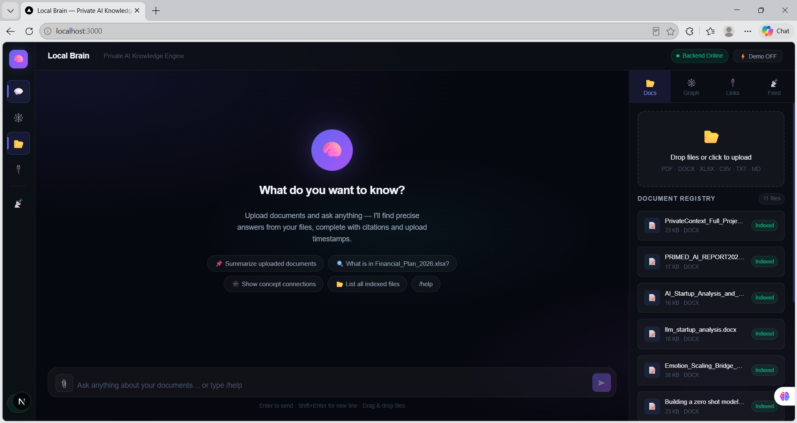
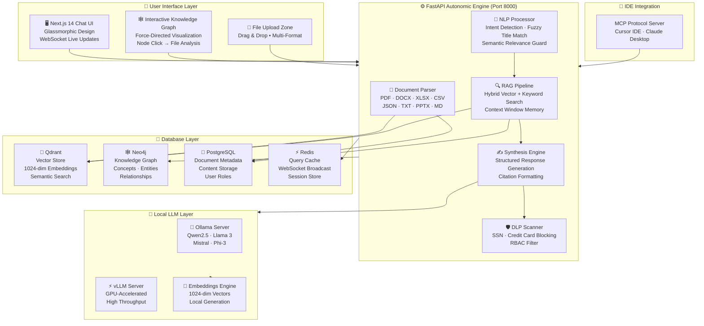
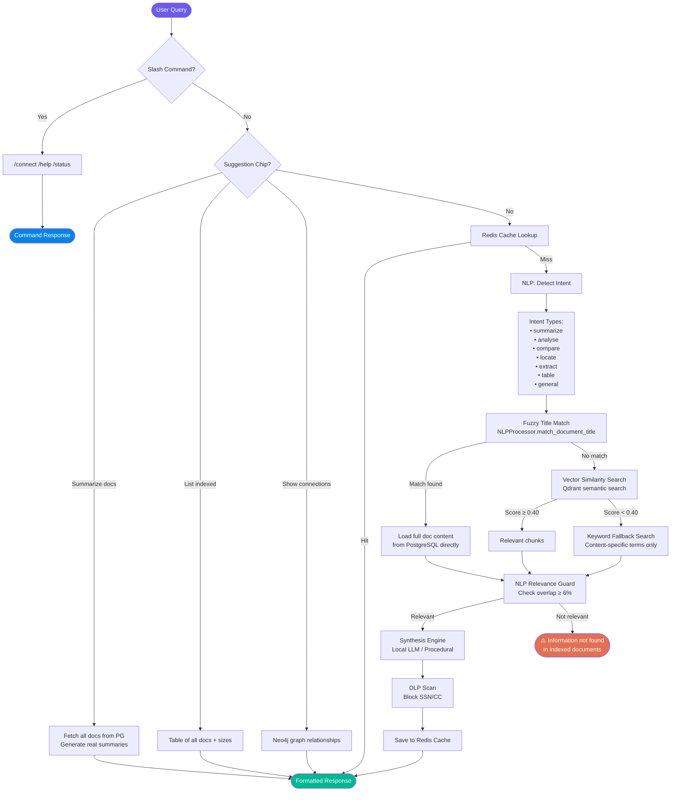

<div align="center">

# 🧠 Local Brain

### Enterprise-Grade · On-Premise · 100% Private AI Knowledge Engine

[](http://www.apache.org/licenses/LICENSE-2.0)
[](https://python.org)
[](https://fastapi.tiangolo.com)
[](https://nextjs.org)
[](https://ollama.com)
[](https://qdrant.tech)
[](https://neo4j.com)
[](https://redis.io)

**Upload your documents. Ask anything. Get precise, cited answers — fully offline.**

*No cloud. No subscriptions. No data ever leaves your machine.*

---

🇺🇸 **English** · [🇪🇸 Español](README_ES.md) · [🇩🇪 Deutsch](README_DE.md) · [🇯🇵 日本語](README_JA.md)

</div>

---

## 🖥️ Live Preview

> Local Brain running locally — zero cloud, 100% private.



---

## 🚀 What is Local Brain?

Local Brain is a **private, self-hosted AI platform** that transforms your organization's documents into a searchable, intelligent knowledge base powered entirely by a **local LLM running on your own hardware**.

Upload files — PDFs, Word docs, Excel sheets, CSVs, Markdown, images — and the system automatically parses, chunks, embeds, and indexes them. The AI answers questions with **exact citations and upload timestamps**, uses **semantic NLP** to understand intent precisely, and **never calls any external API**.

> **Perfect for teams that handle sensitive data** and cannot use cloud AI services.

---

## 🏗️ System Architecture

> Interactive, vector-crisp SVG architectural map. Fully scalable, responsive, and offline-compatible.
> **Note:** For IDE or raw text fallbacks, click below to view the Mermaid representation.

<details>
<summary>💻 View Mermaid Class Diagram Code</summary>


</details>

---

## 🔍 Query & RAG Response Flow

> Full neural-semantic workflow, fuzzy token resolution, intent classification, and RAG retrieval pathways.
> **Note:** For IDE or raw text fallbacks, click below to view the Mermaid representation.

<details>
<summary>💻 View Mermaid Flowchart Code</summary>


</details>

---

## 📐 Layer Breakdown

| Layer | Technology | Purpose |
|:------|:-----------|:--------|
| **🖥️ Chat UI** | Next.js 14 + Glassmorphic CSS | Chat console, file upload, knowledge graph visualization |
| **⚙️ API Backend** | FastAPI + Python 3.10+ | Document ingestion, RAG pipeline, NLP processing, RBAC, DLP |
| **🧠 NLP Engine** | MarkItDown + Custom NLP | Markdown normalization, intent detection, fuzzy title matching |
| **🔷 Vector DB** | Qdrant | 1024-dim semantic chunk storage, sub-200ms similarity search |
| **🕸️ Graph DB** | Neo4j | GraphRAG concept relationships, entity synapses, knowledge mapping |
| **🐘 Relational DB** | PostgreSQL | File metadata, full content, permissions, user roles |
| **⚡ Cache** | Redis | Query caching, WebSocket broadcast, session state |
| **🤖 Local LLM** | Ollama / vLLM | Private embeddings + RAG answer synthesis (fully offline) |
| **🔌 IDE Bridge** | MCP Protocol | Cursor IDE & Claude Desktop direct knowledge access |

---

## ✨ Features

### 🔒 Security & Privacy First
- **100% On-Premise** — Zero data leaves your machine or network, ever
- **DLP Scanner** — Automatically blocks SSNs and credit card numbers from AI responses
- **RBAC** — Role-based access control per document and user group
- **Offline Operation** — Works entirely without internet once set up

### 🧠 Advanced AI Knowledge Engine

#### Semantic NLP Understanding
- **Intent Detection** — Recognizes 7 intent types: `summarize`, `analyse`, `compare`, `locate`, `extract`, `table`, `general`
- **Fuzzy Document Title Matching** — Uses token Jaccard similarity + bigram overlap + exact containment scoring. Asking *"summarize the ai document"* correctly finds `Document.pdf` even with typos or partial names
- **Relevance Guard** — Returns `⚠️ Information not found` when retrieved chunks don't semantically match the query — never serves a wrong document
- **Contextual Memory** — Sliding window of last 5 conversation turns for coherent multi-turn dialogue

#### GraphRAG & Knowledge Extraction
- **Graphify Techniques** — Deep semantic mapping of extracted `concepts`, `entities`, and `relationships` directly into a Neo4j knowledge graph.
- **Pre-computed Relationships** — Provides the local LLM with blazingly fast context retrieval and profound conceptual memory.

#### Deep File Analysis (powered by Microsoft MarkItDown)
- **Unified Async Markdown Parsing** — Converts PDF, DOCX, XLSX, CSV, PPTX, JSON, TXT into clean Markdown natively using high-speed non-blocking syncio threads.
- **Optimized for LLMs** — By standardizing all file types into Markdown, vector embeddings and LLM context comprehension are drastically improved.
- **Images** — Registry path + download link generation

#### Response Intelligence
- **Format-Aware Synthesis** — Tables for numeric data, bullet summaries for text docs, slide outlines for presentations
- **Citation Required & Dynamic Links** — Every answer cites exact document name + upload timestamp, and dynamically generates a robust, case-insensitive download link.
- **Targeted Passage Finder** — Scores every sentence by query-token overlap to surface the most relevant passages
- **Comparison Mode** — Side-by-side markdown tables for multi-document queries

### 💬 Chat Interface
- **Glassmorphic UI** — Dynamic gradients, frosted glass panels, micro-animations
- **Live Log Stream** — Real-time ingestion events via WebSocket
- **Suggestion Chips** — Clickable quick actions (Summarize, List, Show Graph, Analyse)
- **Slash Commands** — `/connect slack <webhook>`, `/connect gmail <token>`, `/help`
- **Download Links** — Direct file download links rendered as clickable markdown

---

## ⚡ Quick Start

### Prerequisites

| Requirement | Version | Purpose |
|:-----------|:--------|:--------|
| Python | 3.10+ | Backend runtime |
| Node.js | 18+ | Frontend build |
| Docker & Docker Compose | Latest | Database stack |
| Ollama | Latest | Local LLM server |

### Step 1 — Clone & Configure

```bash
git clone https://github.com/your-org/localbrain.git
cd localbrain
cp .env.example .env
# Edit .env with your database passwords and model settings
```

### Step 2 — Start Databases (Docker)

```bash
docker-compose up -d
# Starts: Qdrant (6333), Neo4j (7474/7687), PostgreSQL (5432), Redis (6379)
```

### Step 3 — Start the Local LLM (Ollama)

```bash
# Windows (PowerShell)
$env:OLLAMA_ORIGINS="*"; ollama serve

# macOS / Linux
OLLAMA_ORIGINS="*" ollama serve
```

```bash
# Pull a recommended model (in a new terminal)
ollama pull qwen2.5:7b-instruct-q4_K_M
# Or a lighter model for lower-spec machines:
ollama pull qwen2.5:3b-instruct
```

Then set in `.env`:
```properties
VLLM_API_URL=http://localhost:11434/v1
LOCAL_MODEL_NAME=qwen2.5:7b-instruct-q4_K_M
```

### Step 4 — Start the Backend

```bash
python -m venv venv

# Windows:
.\\venv\\Scripts\\Activate.ps1
# macOS/Linux:
source venv/bin/activate

pip install -r core_api/requirements.txt
python -m scripts.init_dbs          # Run once — seeds DB schemas
uvicorn core_api.main:app --port 8000 --reload
```

### Step 5 — Start the Frontend

```bash
cd frontend
npm install
npm run dev
```

Open [http://localhost:3000](http://localhost:3000)

---

## 🔌 GPU-Accelerated vLLM (Optional)

For high-throughput deployments with NVIDIA GPUs:

```bash
pip install vllm
python -m vllm.entrypoints.openai.api_server \
  --model Qwen/Qwen2.5-7B-Instruct \
  --port 8001
```

Update `.env`:
```properties
VLLM_API_URL=http://localhost:8001/v1
LOCAL_MODEL_NAME=Qwen/Qwen2.5-7B-Instruct
```

---

## 🖥️ MCP — IDE Integration

Connect Local Brain to **Cursor IDE** or **Claude Desktop** and query your knowledge base from inside your code editor.

Add to `claude_desktop_config.json`:

```json
{
  "mcpServers": {
    "LocalBrain": {
      "command": "python",
      "args": ["C:/path/to/localbrain/core_api/mcp_server.py"]
    }
  }
}
```

### MCP Tool Reference

| Tool | Description |
|:-----|:-----------|
| `search_wiki` | Semantic search across all indexed documents |
| `get_index` | Lists all document titles, types, and metadata |
| `get_page` | Reads a specific document with its graph relationships |
| `get_overview` | System health: doc count, chunk count, DB status |
| `index_document` | Ingests a new file from a local path into the knowledge base |

---

## 💬 Slash Commands Reference

| Command | Example | What it does |
|:--------|:--------|:------------|
| `/help` | `/help` | Shows all features and usage guide |
| `/connect slack` | `/connect slack https://hooks.slack.com/...` | Mounts Slack webhook integration |
| `/connect notion` | `/connect notion <token> <db_id>` | Connects Notion database |
| `/connect gmail` | `/connect gmail <api_token>` | Mounts Gmail inbox reader |
| `/connect jira` | `/connect jira <url> <token> <project>` | Connects Jira tracker |
| `/connect gdrive` | `/connect gdrive <folder_id>` | Mounts Google Drive folder |

---

## 📁 Project Structure

```
localbrain/
├── core_api/                    # FastAPI backend
│   ├── main.py                  # API routes, upload, query, graph endpoints
│   ├── synthesis.py             # NLP engine + RAG synthesis + DLP guard
│   ├── ingestion.py             # Document parsers + embedding pipeline
│   ├── databases.py             # Qdrant, Neo4j, PostgreSQL, Redis adapters
│   ├── mcp_server.py            # Model Context Protocol server
│   ├── logger.py                # Structured logging
│   ├── config.py                # Environment configuration
│   └── requirements.txt         # Python dependencies
├── frontend/                    # Next.js 14 chat UI
│   └── src/
│       └── app/
│           ├── page.tsx         # Main chat interface
│           ├── globals.css      # Glassmorphic design system
│           └── components/      # Reusable UI components
├── assets/
│   ├── localbrain_screenshot.png  # UI screenshot (shown above)
│   └── localbrain_demo.mp4        # Screen recording demo
├── scripts/                     # DB initialization & seed scripts
├── workers/                     # Background ingestion workers
├── security/                    # DLP rules & auth modules
├── uploaded_docs/               # Persistent document storage
├── temp_uploads/                # Temporary upload staging
├── docker-compose.yml           # Full database stack definition
├── .env.example                 # Configuration template
└── README.md                    # This file
```
## 🧪 Supported File Formats

| Format | Extension | Analysis Type |
|:-------|:----------|:-------------|
| PDF | `.pdf` | Full text, page-by-page extraction |
| Word | `.docx` | Paragraph XML parser |
| Excel | `.xlsx`, `.xls` | Multi-sheet cell resolver + statistics |
| CSV | `.csv` | Row/column structured text |
| PowerPoint | `.pptx` | Slide-by-slide outline |
| JSON | `.json` | Formatted structure display |
| Text | `.txt`, `.md`, `.markdown` | Raw text with chunking |
| Images | `.png`, `.jpg`, `.jpeg` | Registry + download link |

---

## 📄 License

Released under the **[Apache License 2.0](http://www.apache.org/licenses/LICENSE-2.0)**.

---

<div align="center">

Built for teams that take **data privacy seriously**.

*All Local. Zero cloud. 100% yours.*

⭐ **Star this repo** if Local Brain helps your team stay private!

</div>
