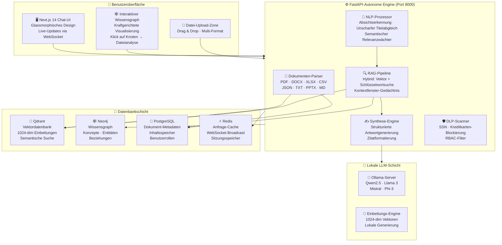
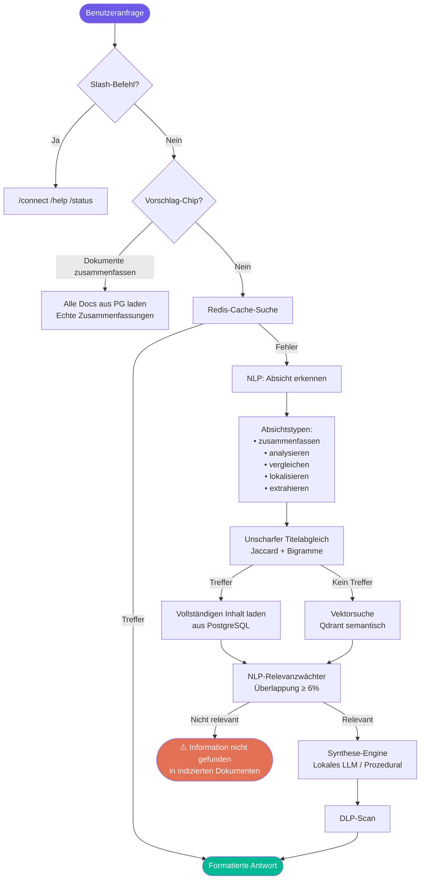

<div align="center">

<p align="center">
  
</p>
<h1 align="center">Local Brain</h1>

### Enterprise-KI-Plattform · On-Premise · 100% Privat

[](http://www.apache.org/licenses/LICENSE-2.0)
[](https://python.org)
[](https://fastapi.tiangolo.com)
[](https://nextjs.org)
[](https://ollama.com)
[](https://qdrant.tech)
[](https://neo4j.com)

**Lade Dokumente hoch. Stelle Fragen. Erhalte präzise, zitierte Antworten — vollständig offline.**

*Keine Cloud. Keine Abonnements. Deine Daten verlassen niemals dein Gerät.*

---

[🇺🇸 English](README.md) · [🇪🇸 Español](README_ES.md) · 🇩🇪 **Deutsch** · [🇯🇵 日本語](README_JA.md)

</div>

---

## 🖥️ Live-Vorschau

> Local Brain läuft lokal — keine Cloud, 100% privat.


---

## 🚀 Was ist Local Brain?

Local Brain ist eine **private, selbst gehostete KI-Plattform**, die die Dokumente deiner Organisation in eine durchsuchbare, intelligente Wissensbasis verwandelt — vollständig betrieben von einem **lokalen LLM auf deiner eigenen Hardware**.

Du lädst Dateien hoch — PDFs, Word-Dokumente, Excel-Tabellen, CSVs, Markdown — und das System analysiert, zerlegt, indiziert und macht diese über eine moderne Chat-Oberfläche abfragbar. Die KI nutzt **fortgeschrittene semantische NLP** und **ruft niemals eine externe API auf**.

> **Ideal für Teams, die mit sensiblen Daten arbeiten** und keine Cloud-KI-Dienste nutzen können.

---

## 🏗️ Systemarchitektur

> Vektorscharfe, interaktive SVG-Systemarchitekturkarte. Vollständig skalierbar, reaktionsschnell und offline-kompatibel.
> **Hinweis:** Für IDEs oder Nur-Text-Reader klicken Sie unten, um die Mermaid-Darstellung anzuzeigen.

<details>
<summary>💻 Mermaid-Diagrammcode anzeigen</summary>


</details>

---

## 🔍 Abfrage- und RAG-Antwortfluss

> Vollständiger neuro-semantischer Workflow, unscharfe Token-Auflösung, Absichts-Klassifizierung und RAG-Synthesepfade.
> **Hinweis:** Für IDEs oder Nur-Text-Reader klicken Sie unten, um die Mermaid-Darstellung anzuzeigen.

<details>
<summary>💻 Mermaid-Diagrammcode anzeigen</summary>


</details>

---

## 📐 Schichtenaufbau

| Schicht | Technologie | Zweck |
|:--------|:-----------|:------|
| **🖥️ Chat-Oberfläche** | Next.js 14 + Glassmorphisches CSS | Chat-Konsole, Datei-Upload, Wissensgraph |
| **⚙️ API-Backend** | FastAPI + Python 3.10+ | Dokumenteneinspeisung, RAG-Pipeline, NLP, RBAC, DLP |
| **🧠 NLP-Engine** | Benutzerdefiniertes Python-NLP | Absichtserkennung, unscharfer Titelabgleich |
| **🔷 Vektor-DB** | Qdrant | 1024-dim semantische Fragmentspeicherung |
| **🕸️ Graph-DB** | Neo4j | Konzeptbeziehungen, Wissensmapping |
| **🐘 Relationale DB** | PostgreSQL | Datei-Metadaten, vollständiger Inhalt, Rollen |
| **⚡ Cache** | Redis | Anfrage-Caching, WebSocket-Broadcast |
| **🤖 Lokales LLM** | Ollama / vLLM | Private Einbettungen + RAG-Antwortsynthese |
| **🔌 IDE-Brücke** | MCP-Protokoll | Cursor IDE & Claude Desktop Direktzugriff |

---

## ✨ Hauptfunktionen

### 🔒 Sicherheit & Datenschutz
- **100% On-Premise** — Keine Daten verlassen jemals dein Gerät oder Netzwerk
- **DLP-Scanner** — Blockiert automatisch SSNs und Kreditkartennummern in KI-Antworten
- **RBAC** — Rollenbasierte Zugriffskontrolle pro Dokument und Benutzergruppe
- **Offline-Betrieb** — Funktioniert vollständig ohne Internet nach der Einrichtung

### 🧠 Fortgeschrittene KI-Engine
- **Absichtserkennung** — Erkennt 7 Typen: `zusammenfassen`, `analysieren`, `vergleichen`, `lokalisieren`, `extrahieren`, `tabelle`, `allgemein`
- **Unscharfer Titelabgleich** — Findet das richtige Dokument auch bei Tippfehlern oder Teilnamen
- **Relevanzwächter** — Liefert niemals ein falsches Dokument
- **Kontextuelles Gedächtnis** — Gleitendes Fenster der letzten 5 Gesprächsrunden

### 📄 Unterstützte Dateiformate
- **PDF** — Vollständige Textextraktion pro Seite
- **DOCX** — Direkter XML-Absatz-Parser
- **XLSX / XLS / CSV** — Mehrblattes Zellenresolver, numerische Statistiken
- **PPTX** — Folie-für-Folie XML-Gliederungsrekonstruktion
- **JSON / TXT / MD** — Native Parser mit vollständiger Indizierung

---

## ⚡ Schnellstart

### Voraussetzungen

| Anforderung | Version |
|:-----------|:--------|
| Python | 3.10+ |
| Node.js | 18+ |
| Docker & Docker Compose | Neueste |
| Ollama | Neueste |

### Schritt 1 — Klonen & Konfigurieren

```bash
git clone https://github.com/deine-org/localbrain.git
cd localbrain
cp .env.example .env
```

### Schritt 2 — Datenbanken starten (Docker)

```bash
docker-compose up -d
```

### Schritt 3 — Lokales LLM starten (Ollama)

```bash
$env:OLLAMA_ORIGINS="*"; ollama serve       # Windows
OLLAMA_ORIGINS="*" ollama serve             # macOS/Linux
ollama pull qwen2.5:7b-instruct-q4_K_M
```

### Schritt 4 — Backend starten

```bash
python -m venv venv && .\\venv\\Scripts\\Activate.ps1
pip install -r core_api/requirements.txt
python -m scripts.init_dbs
uvicorn core_api.main:app --port 8000 --reload
```

### Schritt 5 — Frontend starten

```bash
cd frontend && npm install && npm run dev
```

Öffne [http://localhost:3000](http://localhost:3000)

---

## 📁 Projektstruktur

```
localbrain/
├── core_api/                    # FastAPI-Backend
│   ├── main.py                  # API-Routen: Upload, Abfrage, Graph
│   ├── synthesis.py             # NLP-Engine + RAG-Synthese + DLP-Wächter
│   ├── ingestion.py             # Dokumenten-Parser + Einbettungs-Pipeline
│   ├── databases.py             # Qdrant, Neo4j, PostgreSQL, Redis-Adapter
│   └── mcp_server.py            # MCP-Protokoll-Server
├── frontend/                    # Next.js 14 Chat-Oberfläche
├── assets/
│   ├── localbrain_screenshot.png  # UI-Screenshot (oben gezeigt)
│   └── localbrain_demo.mp4        # Bildschirmaufzeichnung Demo
├── scripts/                     # DB-Initialisierungsskripte
├── workers/                     # Hintergrundverarbeitungs-Worker
├── docker-compose.yml           # Datenbank-Stack-Definition
└── .env.example                 # Konfigurationsvorlage
```

---

## 📄 Lizenz

Veröffentlicht unter der **[Apache Lizenz 2.0](http://www.apache.org/licenses/LICENSE-2.0)**.

---

<div align="center">

Gebaut für Teams, die **Datenschutz ernst nehmen**.

*Alles lokal. Keine Cloud. 100% dein.*

⭐ **Gib dem Repo einen Stern**, wenn Local Brain deinem Team hilft!

</div>
