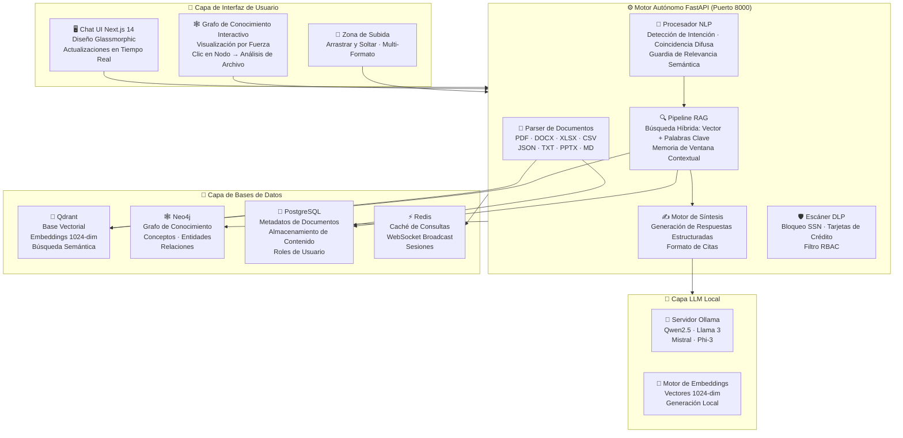
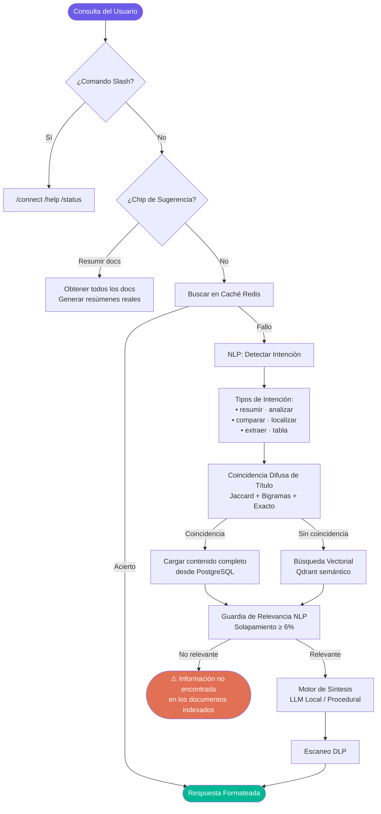

<div align="center">
<p align="center">
  
</p>
<h1 align="center">Local Brain</h1>

### Plataforma de IA Empresarial · On-Premise · 100% Privada

[](http://www.apache.org/licenses/LICENSE-2.0)
[](https://python.org)
[](https://fastapi.tiangolo.com)
[](https://nextjs.org)
[](https://ollama.com)
[](https://qdrant.tech)
[](https://neo4j.com)

**Sube tus documentos. Pregunta cualquier cosa. Obtén respuestas precisas y citadas — completamente offline.**

*Sin nube. Sin suscripciones. Tus datos nunca abandonan tu servidor.*

---

[🇺🇸 English](README.md) · 🇪🇸 **Español** · [🇩🇪 Deutsch](README_DE.md) · [🇯🇵 日本語](README_JA.md)

</div>

---

## 🖥️ Vista Previa en Vivo

> Local Brain ejecutándose localmente — cero nube, 100% privado.


---

## 🚀 ¿Qué es Local Brain?

Local Brain es una **plataforma de IA privada y autohospedada** que convierte los documentos de tu organización en una base de conocimiento inteligente y consultable, impulsada completamente por un **LLM local que se ejecuta en tu propio hardware**.

Sube archivos — PDFs, documentos Word, hojas Excel, CSVs, Markdown — y el sistema los analiza, trocea, indexa y hace consultables a través de una interfaz de chat moderna. La IA usa **NLP semántico avanzado** para entender la intención del usuario y **nunca llama a ninguna API externa**.

> **Perfecto para equipos que manejan datos sensibles** y no pueden usar servicios de IA en la nube.

---

## 🏗️ Arquitectura del Sistema

> Mapa de arquitectura SVG vectorial nítido. Completamente escalable, responsivo y compatible offline.
> **Nota:** Para entornos IDE o lectores de texto plano, haz clic abajo para ver la representación Mermaid.

<details>
<summary>💻 Ver código de diagrama Mermaid</summary>


</details>

---

## 🔍 Flujo de Consulta RAG

> Flujo de trabajo neuro-semántico completo, resolución difusa de tokens, clasificación de intención y vías de síntesis RAG.
> **Nota:** Para entornos IDE o lectores de texto plano, haz clic abajo para ver la representación Mermaid.

<details>
<summary>💻 Ver código de diagrama Mermaid</summary>


</details>

---

## 📐 Desglose por Capas

| Capa | Tecnología | Propósito |
|:-----|:-----------|:---------|
| **🖥️ Interfaz Chat** | Next.js 14 + CSS Glassmorphic | Consola de chat, subida de archivos, visualización del grafo |
| **⚙️ Backend API** | FastAPI + Python 3.10+ | Ingesta, pipeline RAG, procesamiento NLP, RBAC, DLP |
| **🧠 Motor NLP** | MarkItDown + NLP personalizado | Normalización Markdown, detección de intención, coincidencia difusa |
| **🔷 BD Vectorial** | Qdrant | Almacenamiento semántico 1024-dim, búsqueda sub-200ms |
| **🕸️ BD de Grafos** | Neo4j | Relaciones conceptuales GraphRAG, mapeo de conocimiento |
| **🐘 BD Relacional** | PostgreSQL | Metadatos de archivos, contenido completo, roles |
| **⚡ Caché** | Redis | Caché de consultas, WebSocket broadcast |
| **🤖 LLM Local** | Ollama / vLLM | Embeddings privados + síntesis RAG (offline) |
| **🔌 IDE** | Protocolo MCP | Acceso desde Cursor IDE y Claude Desktop |

---

## ✨ Características Principales

### 🔒 Seguridad y Privacidad
- **100% On-Premise** — Cero datos salen de tu máquina o red
- **Escáner DLP** — Bloquea SSNs y números de tarjetas de crédito en respuestas IA
- **RBAC** — Control de acceso basado en roles por documento y usuario
- **Operación Offline** — Funciona completamente sin internet una vez configurado

### 🧠 Motor de IA Avanzado
- **GraphRAG y Extracción (Graphify)** — Mapeo semántico profundo de `conceptos`, `entidades` y `relaciones` en Neo4j.
- **Detección de Intención** — Reconoce 7 tipos: `resumir`, `analizar`, `comparar`, `localizar`, `extraer`, `tabla`, `general`
- **Coincidencia Difusa de Títulos** — Encuentra el documento correcto incluso con nombres parciales o errores tipográficos
- **Guardia de Relevancia** — Nunca devuelve un documento equivocado
- **Memoria Contextual** — Ventana deslizante de últimas 5 conversaciones

### 📄 Formatos Soportados
- **PDF** — Extracción de texto completo por página
- **DOCX** — Parser XML de párrafos (cero dependencias externas)
- **XLSX / XLS / CSV** — Resolvedor de celdas multi-hoja, estadísticas numéricas
- **PPTX** — Reconstrucción de esquema diapositiva por diapositiva
- **JSON / TXT / MD** — Parsers nativos con indexación completa

---

## ⚡ Inicio Rápido

### Requisitos Previos

| Requisito | Versión |
|:---------|:--------|
| Python | 3.10+ |
| Node.js | 18+ |
| Docker & Docker Compose | Última |
| Ollama | Última |

### Paso 1 — Clonar y Configurar

```bash
git clone https://github.com/tu-org/localbrain.git
cd localbrain
cp .env.example .env
```

### Paso 2 — Iniciar Bases de Datos (Docker)

```bash
docker-compose up -d
```

### Paso 3 — Iniciar el LLM Local (Ollama)

```bash
$env:OLLAMA_ORIGINS="*"; ollama serve       # Windows
OLLAMA_ORIGINS="*" ollama serve             # macOS/Linux
ollama pull qwen2.5:7b-instruct-q4_K_M
```

### Paso 4 — Iniciar el Backend

```bash
python -m venv venv && .\\venv\\Scripts\\Activate.ps1
pip install -r core_api/requirements.txt
python -m scripts.init_dbs
uvicorn core_api.main:app --port 8000 --reload
```

### Paso 5 — Iniciar el Frontend

```bash
cd frontend && npm install && npm run dev
```

Abre [http://localhost:3000](http://localhost:3000)

---

## 📁 Estructura del Proyecto

```
localbrain/
├── core_api/                    # Backend FastAPI
│   ├── main.py                  # Rutas API: subida, consulta, grafo
│   ├── synthesis.py             # Motor NLP + síntesis RAG + guardia DLP
│   ├── ingestion.py             # Parsers de documentos + embeddings
│   ├── databases.py             # Adaptadores Qdrant, Neo4j, PostgreSQL, Redis
│   └── mcp_server.py            # Servidor Protocolo MCP
├── frontend/                    # Interfaz Next.js 14
├── assets/
│   ├── localbrain_screenshot.png  # Captura de pantalla (arriba)
│   └── localbrain_demo.mp4        # Grabación de demostración
├── scripts/                     # Scripts de inicialización de BD
├── workers/                     # Workers de integración
├── docker-compose.yml           # Stack completo de bases de datos
└── .env.example                 # Plantilla de configuración
```

---

## 📄 Licencia

Publicado bajo la **[Licencia Apache 2.0](http://www.apache.org/licenses/LICENSE-2.0)**.

---

<div align="center">

Construido para equipos que se toman la **privacidad de datos en serio**.

*Todo local. Cero nube. 100% tuyo.*

⭐ **¡Dale una estrella al repo** si Local Brain ayuda a tu equipo!

</div>
