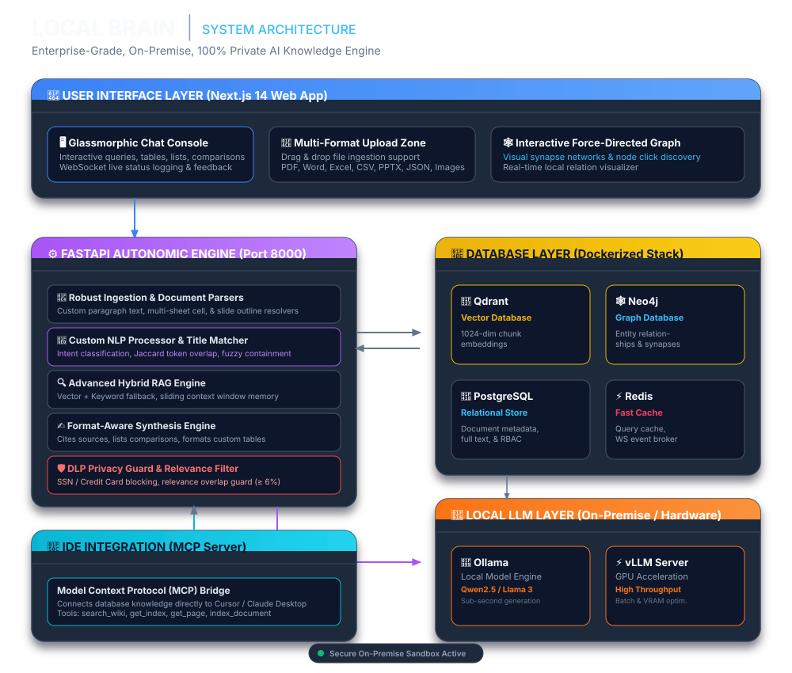
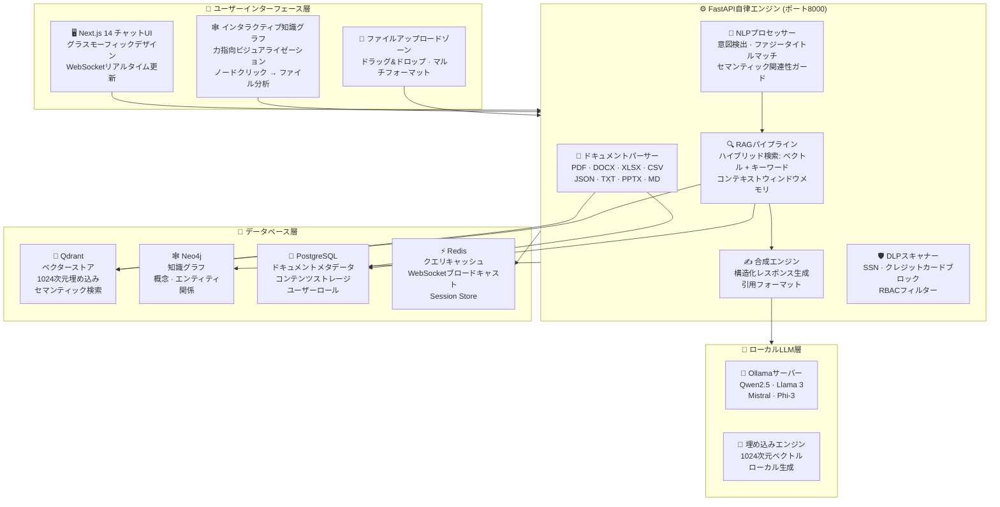
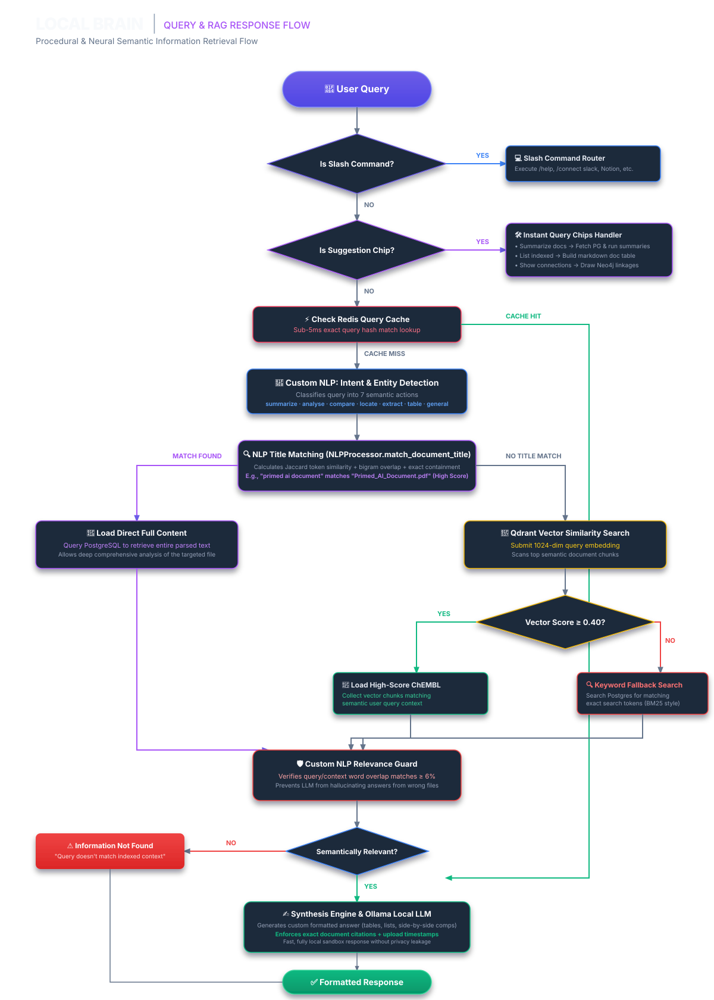
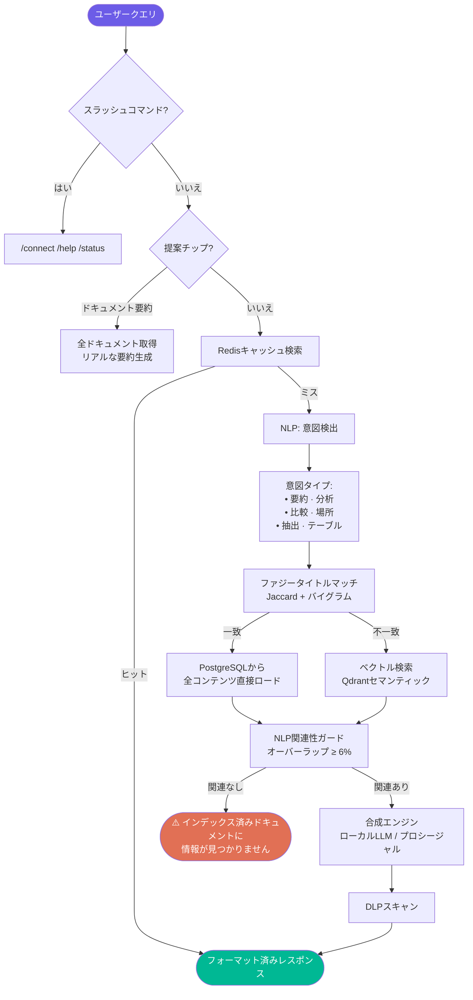

<div align="center">

# 🧠 Local Brain

### エンタープライズAIプラットフォーム · オンプレミス · 100%プライベート

[](http://www.apache.org/licenses/LICENSE-2.0)
[](https://python.org)
[](https://fastapi.tiangolo.com)
[](https://nextjs.org)
[](https://ollama.com)
[](https://qdrant.tech)
[](https://neo4j.com)

**ドキュメントをアップロードし、何でも質問する。完全オフラインで、正確な引用付きの回答を取得。**

*クラウド不要。サブスクリプション不要。データがデバイスを離れることは一切ありません。*

---

[🇺🇸 English](README.md) · [🇪🇸 Español](README_ES.md) · [🇩🇪 Deutsch](README_DE.md) · 🇯🇵 **日本語**

</div>

---

## 🖥️ ライブプレビュー

> Local Brain がローカルで動作中 — クラウドなし、100%プライベート。


---

## 🎬 デモ録画

> Local Brain の動作をご覧ください: ドキュメントのアップロード、質問、知識グラフの探索。

https://github.com/user-attachments/assets/localbrain_demo.mp4

> **注意:** ブラウザで動画が再生されない場合は、[こちらからダウンロード](assets/localbrain_demo.mp4)してください。

---

## 🚀 Local Brain とは？

Local Brain は、**プライベートでセルフホストのAIプラットフォーム**です。組織のドキュメントを、**自前のハードウェア上で動作するローカルLLM**によって完全に駆動された、検索可能でインテリジェントな知識ベースに変換します。

PDF、Wordドキュメント、Excelシート、CSV、Markdownなどのファイルをアップロードすると、システムが自動的に解析・チャンク分割・インデックス化します。AIは**高度なセマンティックNLP**でユーザーの意図を正確に理解し、**外部APIを一切呼び出しません**。

> **機密データを扱うチームに最適です** — クラウドAIサービスが使えない組織のために。

---

## 🏗️ システムアーキテクチャ

> ベクターで鮮明なインタラクティブSVGシステムアーキテクチャマップ。完全にスケーラブル、レスポンシブ、かつオフライン対応。
> **注意:** IDEやプレーンテキストリーダーをご使用の場合は、以下をクリックして Mermaid 表記を展開してください。



<details>
<summary>💻 Mermaid クラス図コードを表示</summary>


</details>

---

## 🔍 クエリとRAGレスポンスフロー

> 完全なニューラル・セマンティック・ワークフロー、ファジートークン解決、意図分類、および RAG 合成パス。
> **注意:** IDEやプレーンテキストリーダーをご使用の場合は、以下をクリックして Mermaid 表記を展開してください。



<details>
<summary>💻 Mermaid フローチャートコードを表示</summary>


</details>

---

## 📐 レイヤー構成

| レイヤー | 技術 | 目的 |
|:--------|:----|:----|
| **🖥️ チャットUI** | Next.js 14 + グラスモーフィックCSS | チャットコンソール、ファイルアップロード、知識グラフ可視化 |
| **⚙️ APIバックエンド** | FastAPI + Python 3.10+ | 取り込み、RAGパイプライン、NLP処理、RBAC、DLP |
| **🧠 NLPエンジン** | MarkItDown + カスタムNLP | Markdown正規化、意図検出、ファジータイトルマッチ |
| **🔷 ベクターDB** | Qdrant | 1024次元セマンティックチャンク、200ms以下の検索 |
| **🕸️ グラフDB** | Neo4j | GraphRAG概念関係、エンティティシナプス、知識マッピング |
| **🐘 リレーショナルDB** | PostgreSQL | ファイルメタデータ、全コンテンツ、権限、ロール |
| **⚡ キャッシュ** | Redis | クエリキャッシング、WebSocketブロードキャスト |
| **🤖 ローカルLLM** | Ollama / vLLM | プライベート埋め込み + RAG回答合成（完全オフライン） |
| **🔌 IDEブリッジ** | MCPプロトコル | Cursor IDE & Claude Desktopから直接アクセス |

---

## ✨ 主要機能

### 🔒 セキュリティとプライバシー
- **100%オンプレミス** — データがデバイスやネットワークを離れることは絶対にない
- **DLPスキャナー** — AIレスポンスからSSNとクレジットカード番号を自動ブロック
- **RBAC** — ドキュメントとユーザーグループごとのロールベースアクセス制御
- **オフライン動作** — セットアップ後はインターネットなしで完全に動作

### 🧠 高度なAI知識エンジン
- **意図検出** — 7タイプを認識: `要約`, `分析`, `比較`, `場所確認`, `抽出`, `テーブル`, `一般`
- **ファジータイトルマッチング** — 部分的な名前やタイプミスでも正しいドキュメントを検索
- **関連性ガード** — 間違ったドキュメントを提供することはない
- **コンテキストメモリ** — 最後の5回の会話のスライディングウィンドウ

### 📄 対応ファイル形式

| 形式 | 拡張子 | 分析タイプ |
|:-----|:------|:---------|
| PDF | `.pdf` | ページごとの全文抽出 |
| Word | `.docx` | パラグラフXMLパーサー |
| Excel | `.xlsx`, `.xls` | マルチシートセルリゾルバー + 統計 |
| CSV | `.csv` | 行/列の構造化テキスト |
| PowerPoint | `.pptx` | スライドごとのアウトライン |
| JSON | `.json` | フォーマット済み構造表示 |
| テキスト | `.txt`, `.md` | チャンク付き生テキスト |
| 画像 | `.png`, `.jpg` | レジストリ + ダウンロードリンク |

---

## ⚡ クイックスタート

### 前提条件

| 要件 | バージョン |
|:----|:---------|
| Python | 3.10+ |
| Node.js | 18+ |
| Docker & Docker Compose | 最新 |
| Ollama | 最新 |

### ステップ 1 — クローンと設定

```bash
git clone https://github.com/your-org/localbrain.git
cd localbrain
cp .env.example .env
```

### ステップ 2 — データベース起動（Docker）

```bash
docker-compose up -d
```

### ステップ 3 — ローカルLLM起動（Ollama）

```bash
$env:OLLAMA_ORIGINS="*"; ollama serve       # Windows
OLLAMA_ORIGINS="*" ollama serve             # macOS/Linux
ollama pull qwen2.5:7b-instruct-q4_K_M
```

### ステップ 4 — バックエンド起動

```bash
python -m venv venv && .\\venv\\Scripts\\Activate.ps1
pip install -r core_api/requirements.txt
python -m scripts.init_dbs
uvicorn core_api.main:app --port 8000 --reload
```

### ステップ 5 — フロントエンド起動

```bash
cd frontend && npm install && npm run dev
```

[http://localhost:3000](http://localhost:3000) を開く

---

## 📁 プロジェクト構造

```
localbrain/
├── core_api/                    # FastAPIバックエンド
│   ├── main.py                  # APIルート: アップロード、クエリ、グラフ
│   ├── synthesis.py             # NLPエンジン + RAG合成 + DLPガード
│   ├── ingestion.py             # ドキュメントパーサー + 埋め込みパイプライン
│   ├── databases.py             # Qdrant, Neo4j, PostgreSQL, Redisアダプター
│   └── mcp_server.py            # MCPプロトコルサーバー
├── frontend/                    # Next.js 14 チャットUI
├── assets/
│   ├── localbrain_screenshot.png  # UIスクリーンショット（上記参照）
│   └── localbrain_demo.mp4        # スクリーン録画デモ
├── scripts/                     # DB初期化スクリプト
├── workers/                     # バックグラウンド取り込みワーカー
├── docker-compose.yml           # データベーススタック定義
└── .env.example                 # 設定テンプレート
```

---

## 📄 ライセンス

**[Apache License 2.0](http://www.apache.org/licenses/LICENSE-2.0)** の下でリリース。

---

<div align="center">

**データプライバシーを真剣に考えるチーム**のために作られました。

*すべてローカル。クラウドなし。100%あなたのもの。*

⭐ Local Brain があなたのチームのプライバシー保護に役立てば、**スターをお願いします！**

</div>
